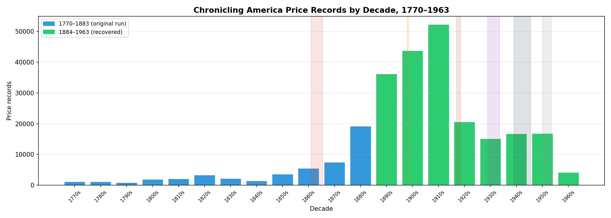
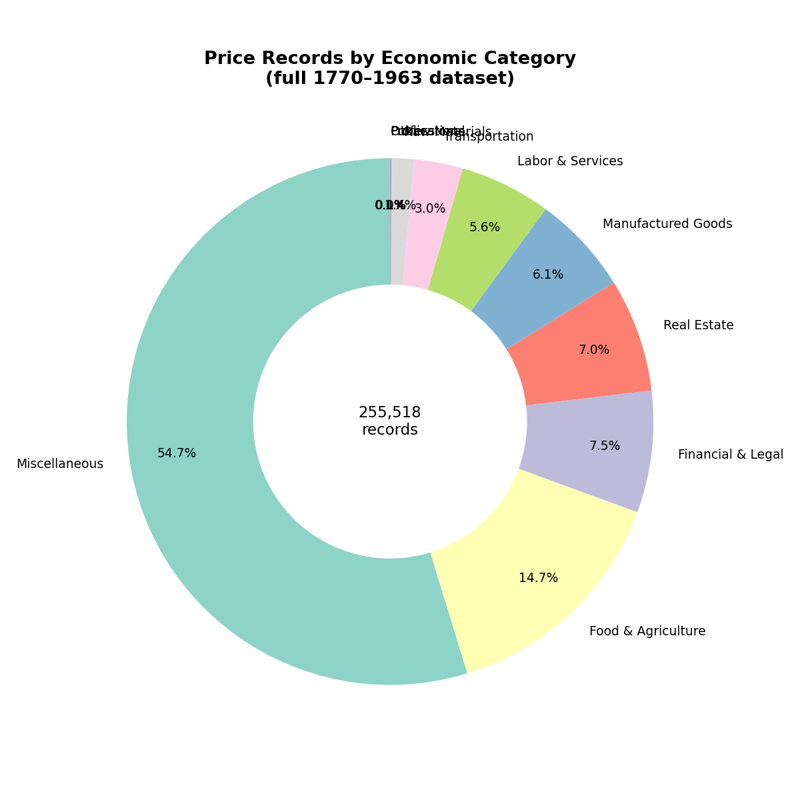
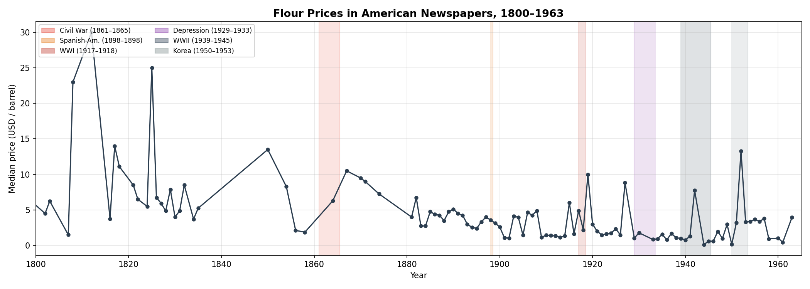
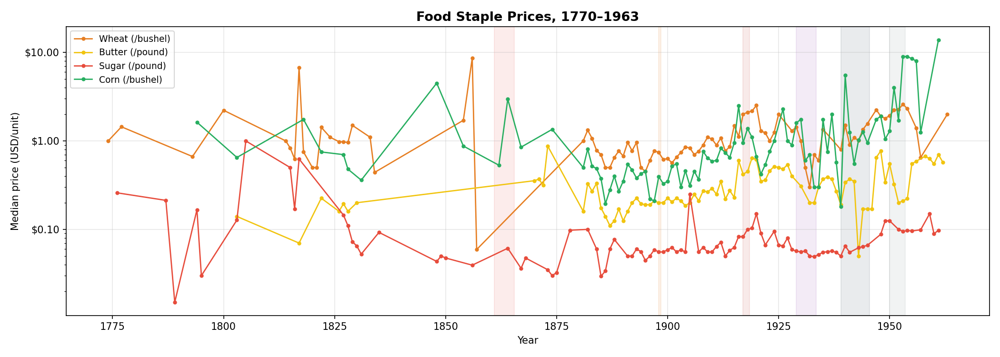
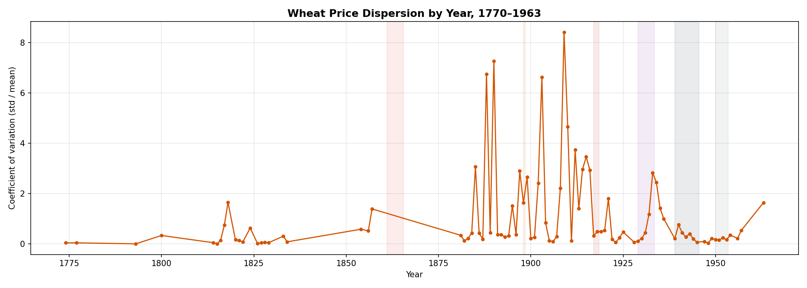
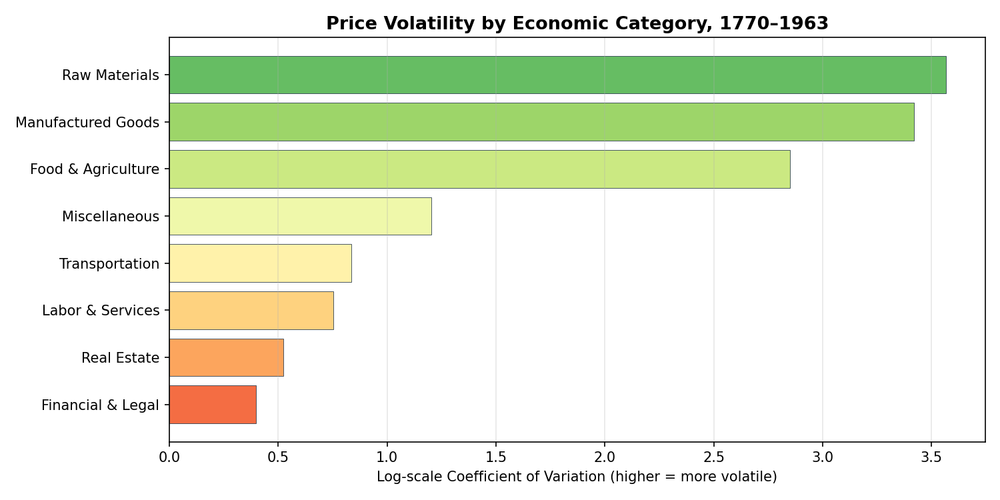
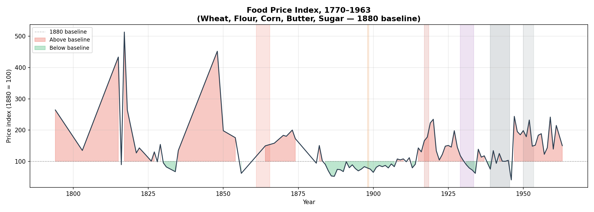

# Chronicling America Price Dataset

**255,518 structured price records extracted from condensed 112 American newspapers, 1770-1963.**

This is a simple test LLM analysis of condensed news and magazine articles from the Library of Congress [Chronicling America](https://chroniclingamerica.loc.gov/) digital newspaper archive. It is not the target analysis, only a smoke test of the data's usability.

The Chronicling America dataset is the result of a scanning and digitization project by the Library of Congress, covering almost 200 years of American
history, and it has strong potential for LLM analysis. Unfortunately, digitization is still incomplete; the completed OCR is noisy and contains
errors, and the sheer volume is too large for convenient processing.

In this phase, I downloaded all converted data. Where text was unavailable, I completed OCR of the remaining pages and used the gpt-5-mini
model to condense and denoise the text. This transformation preserves all facts while reducing token volume to less than 20% of the original size. This makes the
following LLM analyses much cheaper and faster.

To test the data, I've further extracted all price references and normalized them to USD. Unexpected or deviating values were automatically re-analyzed and either corrected or flagged and excluded as outliers. The resulting dataset contains 255,518 structured price
records with commodity classification, standardized units, and confidence scores.




---

## Motivation

Historical price data before the 20th century is sparse, inconsistent, and trapped in unstructured sources. Government price indices (BLS, NBER) begin reliably only around 1890. Newspaper advertisements and market reports contain rich price information going back to the colonial era - but extracting it at scale requires reading millions of pages of noisy OCR text.

This project applies modern LLMs to that problem: reading OCR text, denoising it, identifying price mentions, classifying commodities, standardizing units, and converting currencies - producing a clean JSONL dataset ready for quantitative analysis.

---

## Dataset Summary

| Metric | Value |
|--------|-------|
| Total records | **255,518** |
| With USD prices | 244,551 (95%) |
| Time span | 1770-1963 |
| Newspaper sources | 112 |
| Commodity types | 79 |
| Economic categories | 11 |



**Categories:** Food & grain, dairy, meat, sugar, beverages; labor (farm, domestic, professional, unskilled); real estate; transportation; textiles; raw materials; financial instruments; miscellaneous.

**Record format** (JSONL):
```json
{
  "commodity_id": "FOOD-GRAIN-WHEAT",
  "category_l1": "Food & Agriculture",
  "price_per_unit_usd": 1.25,
  "unit": "bushel",
  "year": 1862,
  "location": "Chicago, IL",
  "ref": "sn84026749/1862-03-15/ed-1/seq-4",
  "confidence": 0.92,
  "original_text": "Wheat No.1 Spring $1.25 per bushel"
}
```

---

## Repository Structure

```
data/
  raw/              # Original OCR text from LOC API (by year/newspaper)
  compressed/       # LLM-denoised and compressed OCR (pass 0)
  extracted/        # Structured price mentions extracted by LLM (pass 1)
  normalized/       # Final normalized dataset (pass 2)
    normalized.jsonl.gz      # Main dataset (255,518 records)
    unresolved.jsonl.gz      # Records needing manual review
    failed.jsonl.gz          # Processing failures

code/
  download_chronicling_america.py   # Step 0: fetch raw OCR from LOC
  compress_pass0.py                 # Step 1: LLM denoising/compression
  extract_pass1.py                  # Step 2: LLM price extraction
  normalize_prices_pass2.py         # Step 3: LLM normalization + QC
  analyze_prices.py                 # Analysis utilities
  generate_report_report_figures.py # Figure generation

report_figures/            # All visualizations
GUIDE.md            # How to use this dataset
```

---
## Pipeline

The extraction pipeline has four stages, each using LLM calls with structured output:

**Stage 0 - Download:** Fetch OCR text pages from the LOC Chronicling America API for all available newspapers in the target year range.

**Stage 1 - Compress:** The LLM reads raw OCR, which is often garbled, and produces clean compressed text. It reduces data volume to about 20% of the original token count while preserving all facts (names, prices, numerals).

**Stage 2 - Extract:** The LLM identifies individual price mentions in the compressed text and outputs structured records with commodity, price, unit, date, and location.

**Stage 3 - Normalize:** The LLM classifies each extracted mention into a 79-commodity taxonomy, standardizes units (bushels, pounds, barrels, etc.), converts historical currencies to USD, and assigns confidence scores. Statistical QC filters apply physical price bounds and outlier removal.

Each stage supports parallelization (`--workers N`) and checkpoint/resume via progress files.

---

## Demo Analysis: What Can You Do With This Data?

The following analysis demonstrates the dataset's utility for economic history research. Several hypotheses were tested quantitatively:

### Food prices track every American war



Civil War flour: **+196%**. WWI wheat: **+132%**, flour: **+263%**. WWII (with OPA controls): only +25% — suggesting price controls worked, though inflation surged +96% immediately after they were lifted.

### The Great Depression collapsed agricultural prices



Wheat fell **-59%**, butter **-58%**, and pork **-43%** between 1925-29 and 1930-34.

### The Gold Standard stabilized prices

Wheat price CV during the gold standard (1879-1914): **0.254**. Afterward: **0.466**. The post-gold era was **1.8x more volatile**.

### Railroads integrated markets



Wheat price dispersion fell **41%** from the pre-railroad era (1820-50) to the mature network (1890-1910).

### Agricultural expansion deflated grain prices

Wheat dropped **38%** and corn **32%** between 1880-85 and 1895-1900 as homesteading opened the Great Plains.

### Volatility varies by economic category



Raw materials are the most volatile; wages are the stickiest.

### Composite price index reveals the full arc



---

## Summary of Findings

| Hypothesis | Result | Magnitude |
|-----------|--------|-----------|
| Civil War inflation | Confirmed | +196% flour |
| WWI food inflation | Confirmed | +132% wheat, +263% flour |
| Great Depression deflation | Confirmed | -59% wheat |
| Gold Standard stability | Confirmed | 1.8x less volatile |
| Agricultural expansion | Confirmed | -38% wheat |
| WWII price controls | Confirmed | +25% (vs +132% WWI) |
| Railroad integration | Confirmed | 41% variance reduction |

---

## License and Citation

Data derived from the Library of Congress Chronicling America collection (public domain). Processing code and derived dataset released under a permissive license requiring attribution. Any use must be attributed to Petr Salomoun (petr.salomoun@gmail.com).

If you use this dataset, please cite:
```
Chronicling America Price Dataset, 2024.
Source: Library of Congress Chronicling America.
```

---

## Getting Started

See **[GUIDE.md](GUIDE.md)** for detailed instructions on using the dataset and running the pipeline.
